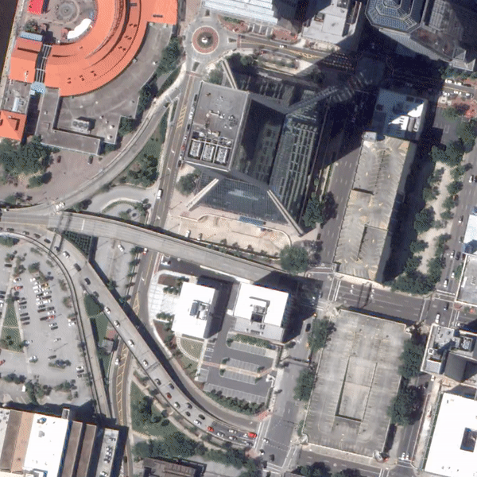
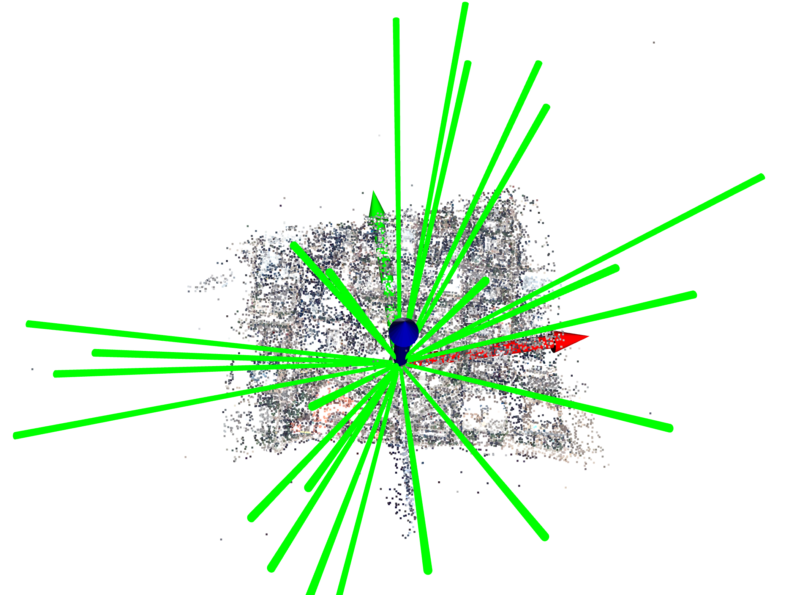
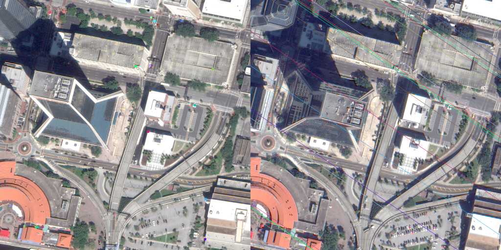
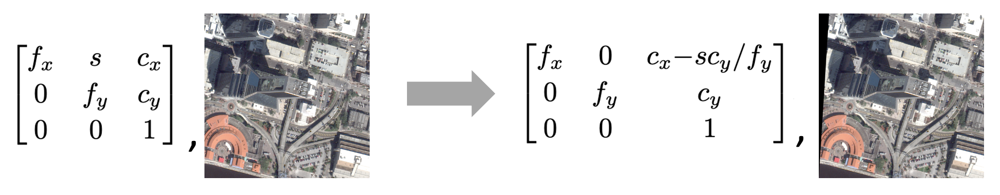
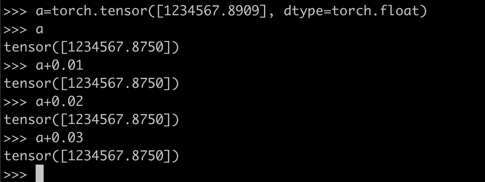

# Satellite Structure from Motion

Maintained by [Kai Zhang](https://kai-46.github.io/website/).

## Why this repo?

I started my computer vision research journey with satellite stereo being my first project. Working on that problem makes me feel that there seems to be an unnesseary[?] gap between how the stereo problems are approached in the computer vision community and remote sensing community. And moreover, satellite images seem to attract relatively less attention from the vast computer vision community. I was guessing perhaps this was due to the limited satellite image availability, which seems to be improving these days. With the increasing availability of satellite datasets, I am hoping to further simplify the access to satellite stereo problems for computer vision researchers' and practitioners' with this repo.

## Development roadmaps (Open-source contributions are always welcome!)

- [x] release SatelliteSfM
- [x] release [SatelliteNeRF](https://github.com/Kai-46/SatelliteNeRF) as downstream neural rendering applications
- [x] release scripts to visualize SatelliteSfM output cameras in 3D
- [x] release [TRACK 3: MULTI-VIEW SEMANTIC STEREO](https://ieee-dataport.org/open-access/data-fusion-contest-2019-dfc2019) data preprocessed by SatelliteSfM
- [x] re-write [ColmapForVisSat](https://github.com/Kai-46/ColmapForVisSat) as patches to latest [Colmap](https://github.com/colmap/colmap): SfM first, followed by MVS, and finally meshing. You can find the re-written version [ColmapForVisSatPatched](https://github.com/SBCV/ColmapForVisSatPatched). Thanks to @SBCV. 
- [x] release [SatelliteNeuS](https://github.com/Kai-46/SatelliteNeuS) that can reconstruct meshes from multi-date satellite images with varying illuminations 
- [x] draw a road map
- [ ] improve documentations of the [SatellitePlaneSweep](https://github.com/Kai-46/SatellitePlaneSweep) and [SatelliteNeRF](https://github.com/Kai-46/SatelliteNeRF) and [SatelliteNeuS](https://github.com/Kai-46/SatelliteNeuS)
- [ ] port [SatelliteSurfaceReconstruction](https://github.com/SBCV/SatelliteSurfaceReconstruction) meshing algorithm to the new API
- [ ] release Deep Satellite Stereo as downstream MVS algorithms
- [ ] release code to rectify satellite stereo pairs based on the SatelliteSfM outputs
- [ ] release code to run stereo matching on rectified stereo pairs, including both classical and deep ones


## Relevant repos for downstream applications

- [Satellite-based Neural Radiance Fields](https://github.com/Kai-46/SatelliteNeRF)

## Overview

- This is a library dedicated to solving the satellite structure from motion problem.
- It's a wrapper of the [VisSatSatelliteStereo repo](https://github.com/Kai-46/VisSatSatelliteStereo) for easier use.
- The outputs are png images and **OpenCV-compatible** pinhole cameras readily deployable to multi-view stereo pipelines targetting ground-level images.

## Installation

Assume you are on a Linux machine with at least one GPU, and have conda installed. Then to install this library, simply by:

```bash
. ./env.sh
```

## Inputs

We assume the inputs to be a set of .tif images encoding the 3-channel uint8 RGB colors, and the metadata like RPC cameras.
This data format is to align with the public satellite benchmark: [TRACK 3: MULTI-VIEW SEMANTIC STEREO](https://ieee-dataport.org/open-access/data-fusion-contest-2019-dfc2019).
Download one example data from this [google drive](https://drive.google.com/drive/folders/11UeurSa-dyfaRUIdUZFfNBAyd3jN7D46?usp=sharing); folder structure look like below:

```
- examples/inputs
    - images/
        - *.tif
        - *.tif
        - *.tif
        - ...
    - latlonalt_bbx.json
```

, where ```latlonalt_bbx.json``` specifies the bounding box for the site of interest in the global (latitude, longitude, altitude) coordinate system.

If you are not sure what is a reasonably good altitude range, you can put random numbers in the json file, but you have to enable the ```--use_srtm4``` option below.  

## Run Structure from Motion

```bash
python satellite_sfm.py --input_folder examples/inputs --output_folder examples/outputs --run_sfm [--use_srtm4] [--enable_debug]
```

The ```--enable_debug``` option outputs some visualization helpful debugging the structure from motion quality.

## Outputs

- ```{output_folder}/images/``` folder contains the png images
- ```{output_folder}/cameras_adjusted/``` folder contains the bundle-adjusted pinhole cameras; each camera is represented by a pair of 4x4 K, W2C matrices that are OpenCV-compatible.
- ```{output_folder}/enu_bbx_adjusted.json``` contains the scene bounding box in the local ENU Euclidean coordinate system.
- ```{output_folder}/enu_observer_latlonalt.json``` contains the observer coordinate for defining the local ENU coordinate; essentially, this observer coordinate is only necessary for coordinate conversion between local ENU and global latitude-longitude-altitude.

If you turn on the ```--enable_debug``` option, you might want to dig into the folder ```{output_folder}/debug_sfm``` for visuals, etc.

## Citations

```
@inproceedings{VisSat-2019,
  title={Leveraging Vision Reconstruction Pipelines for Satellite Imagery},
  author={Zhang, Kai and Sun, Jin and Snavely, Noah},
  booktitle={IEEE International Conference on Computer Vision Workshops},
  year={2019}
}

@inproceedings{schoenberger2016sfm,
  author={Sch\"{o}nberger, Johannes Lutz and Frahm, Jan-Michael},
  title={Structure-from-Motion Revisited},
  booktitle={Conference on Computer Vision and Pattern Recognition (CVPR)},
  year={2016},
}
```

## Example results

### input images



### sparse point cloud ouput by SfM


### Visualize cameras

```
python visualize_satellite_cameras.py
```

Red, Green, Blue axes denote east, north, up directions, respectively. For simplicity, each camera is represented by a line pointing from origin to that camera center.


### homograhpy-warp one view, then average with another by a plane sequence


[high-res video](https://drive.google.com/file/d/13TshDCsHTx0J7X6UFd0zglutQkD8NgyK/view?usp=sharing)

### inspect epipolar geometry

```
python inspect_epipolar_geometry.py
```



### get zero-skew intrincics marix

```
python skew_correct.py --input_folder ./examples/outputs ./examples/outputs_zeroskew
```



## Downstream applications

One natural task following this SatelliteSfM is to acquire the dense reconstruction by classical patch-based MVS, or mordern deep MVS, or even neural rendering like NeRF. When working with these downstream algorithms, be careful of the float32 pitfall caused by the huge depth values as a result of **satellite cameras being distant from the scene**; this is particularly worthy of attention with the prevalent float32 GPU computing.  

[Note: this SatelliteSfM library doesn't have such issue for the use of float64.]

### pitfall of float32 arithmetic



### overcome float32 pitfall for NeRF

Center and scale scene to be inside unit sphere by:

```bash
python normalize_sfm_reconstruction.py
```

Modify how ```pixel2ray``` is computed for NeRF-based models, while keeping the other parts unchanged:

```python
import torch

def pixel2ray(col: torch.Tensor, row: torch.Tensor, K: torch.DoubleTensor, W2C: torch.DoubleTensor):
    '''
    Assume scene is centered and inside unit sphere.

    col, row: both [N, ]; float32
    K, W2C: 4x4 opencv-compatible intrinsic and W2C matrices; float64

    return:
        ray_o, ray_d: [N, 3]; float32
    '''
    C2W = torch.inverse(W2C)  # float64
    px = torch.stack((col, row, torch.ones_like(col)), axis=-1).unsqueeze(-1)  # [N, 3, 1]; float64
    K_inv = torch.inverse(K[:3, :3]).unsqueeze(0).expand(px.shape[0], -1, -1)  # [N, 3, 3]; float64
    c2w_rot = C2W[:3, :3].unsqueeze(0).expand(px.shape[0], -1, -1) # [N, 3, 3]; float64
    ray_d = torch.matmul(c2w_rot, torch.matmul(K_inv, px.double())) # [N, 3, 1]; float64
    ray_d = (ray_d / ray_d.norm(dim=1, keepdims=True)).squeeze(-1) # [N, 3]; float64

    ray_o = C2W[:3, 3].unsqueeze(0).expand(px.shape[0], -1) # [N, 3]; float64
    # shift ray_o along ray_d towards the scene in order to shrink the huge depth
    shift = torch.norm(ray_o, dim=-1) - 5.  # [N, ]; float64; 5. here is a small margin
    ray_o = ray_o + ray_d * shift.unsqueeze(-1)  # [N, 3]; float64
    return ray_o.float(), ray_d.float()
```
<!--  -->
<https://user-images.githubusercontent.com/21653654/153779703-36b50265-ae3b-41ac-8139-2e0bf081f28d.mp4>

<https://user-images.githubusercontent.com/21653654/153779789-93f68ce9-9cc4-4947-81de-d6d2104ae0ac.mp4>

<https://user-images.githubusercontent.com/21653654/153779889-8116d7ee-8a4d-474c-8d52-3b1f0e175104.mp4>

<https://user-images.githubusercontent.com/21653654/153779898-dba46433-143e-499a-9315-4316747e6e59.mp4>

<https://user-images.githubusercontent.com/21653654/153779906-b4196d7d-afd7-4fde-b691-0d7c6a785f8b.mp4>

<https://user-images.githubusercontent.com/21653654/153779913-36931e65-2739-4d35-8901-22808d8eaced.mp4>

<https://user-images.githubusercontent.com/21653654/153779919-5157b7df-d59b-48f8-a66c-7982b600e01d.mp4>

<https://user-images.githubusercontent.com/21653654/153779930-9902b8b3-b035-4c78-ac51-ff97dbb0f266.mp4>

<https://user-images.githubusercontent.com/21653654/153779937-74ef0a19-8ce8-4d87-84a3-357513c419ed.mp4>

<https://user-images.githubusercontent.com/21653654/153780455-939f4e36-794b-4282-b9a1-c1b98e8a1866.mp4>

### overcome float32 pitfall for neural point based graphics

to be filled...

### overcome float32 pitfall for plane sweep stereo, or patch-based stereo, or deep stereo

to be filled...

## preprocessed satellite multi-view stereo dataset with ground-truth

This dataset can be used for evaluating multi-view stereo, running neural rendering, etc. You can download it from [google drive](https://drive.google.com/drive/folders/1Do7oF36sCEBWrcIiCzgHbhF5kQMawjVo?usp=sharing).

## More handy scripts are coming

Stay tuned :-)
